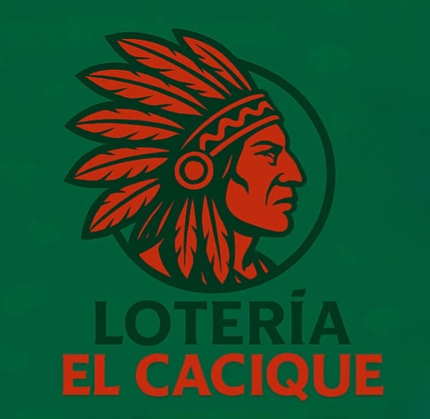
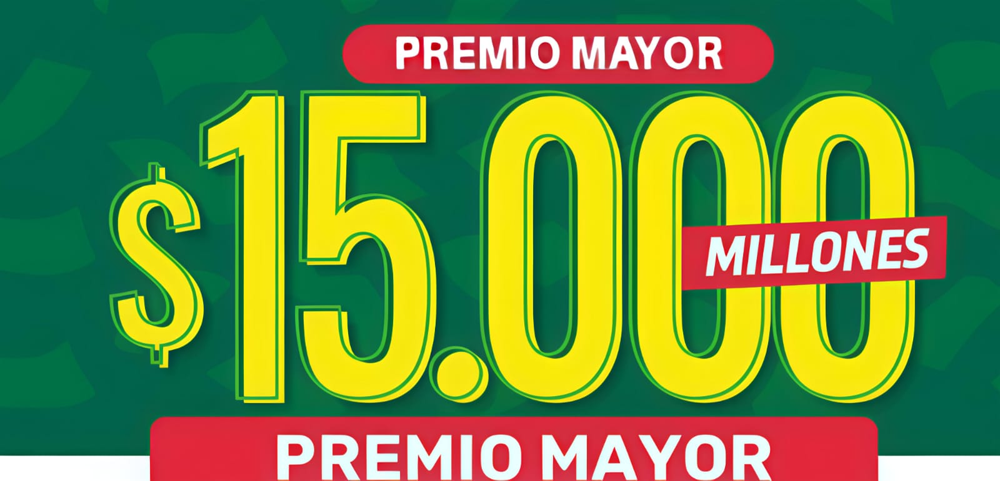

<!DOCTYPE html>
<html lang="es">
<head>
  <meta charset="UTF-8">
  <meta name="viewport" content="width=device-width, initial-scale=1.0">
  <title>Lotería de Boyacá</title>
  
</head>
<body>
  <header>
    
    <h1>¡Un Lunes de pobre lo sacará!</h1>
  </header>
  

    <h2>Resultado sorteo #4582</h2>
    
<strong>Lunes 28 de julio de 2025</strong>

    

      <h3>Número Ganador</h3>
      

        
2

        
3

        
0

        
1

      

      <h3>Serie</h3>
      

        
2

        
0

        
7

      

      <h3>Lanzamiento adicional</h3>
      

        
7

        
7

        
4

        
7

        
0

        
0

      

    

    <!-- TEXTO DEL GANADOR -->
    

      GANADOR DEL PREMIO MAYOR: JOSÉ DEL CARMEN BATISTA CASTILLO 
    <header>
    

  
